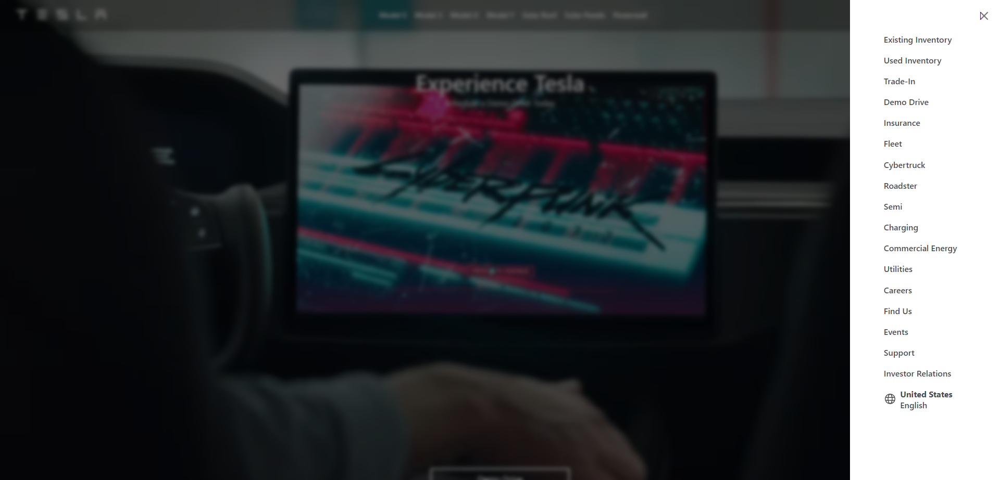

# Tesla Clone - Part 7 Menu Added

This repository contains a simple HTML and CSS implementation of the Part 7 part of the Tesla website ([https://www.tesla.com/](https://www.tesla.com/)). The purpose of this project is to recreate the navigation bar, providing a similar look and feel to the original Tesla website.

## Table of Contents

- [Demo](#demo)
- [Features](#features)
- [Installation](#installation)
- [Usage](#usage)
- [Acknowledgments](#acknowledgments)

## Demo

* Here's screenshot of how it should look ~ This is screenshot of all three sections.

## Features

- Design: The Part 7 Menu Added, has looks and feel of original Tesla Website, and works better on Desktop.
- Menu items: Recreates the main menu items present on the original Tesla website.
- Created Menu with design and attached all the links to it. 

## Installation

To get started with this project, you can simply clone the repository to your local machine using the following command:

git clone https://github.com/gogirlorganisation/Web-Dev-Curriculum

## Usage

After cloning the repository, you can open the `index.html` file in your web browser to view the Tesla Section Three clone.

## Acknowledgments

This project was inspired by the Tesla website ([https://www.tesla.com/](https://www.tesla.com/)) and is intended for educational purposes only.